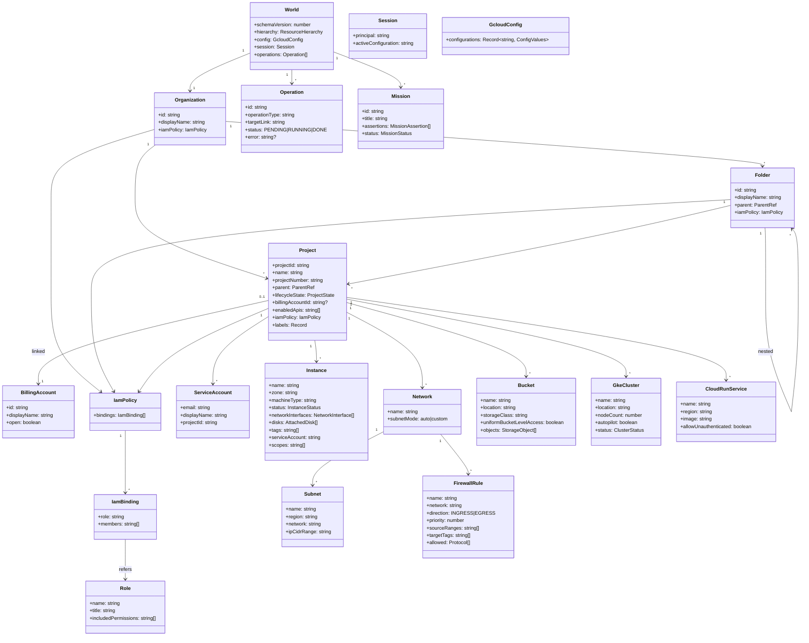
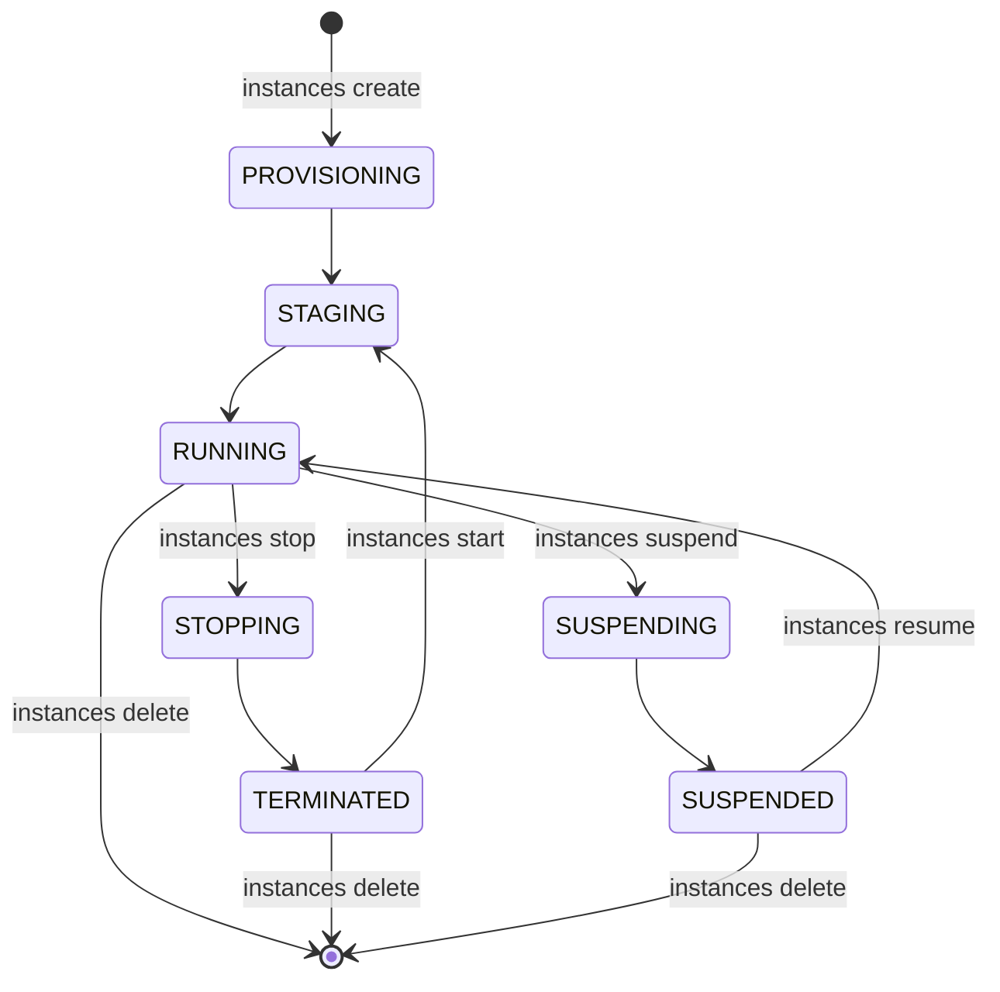
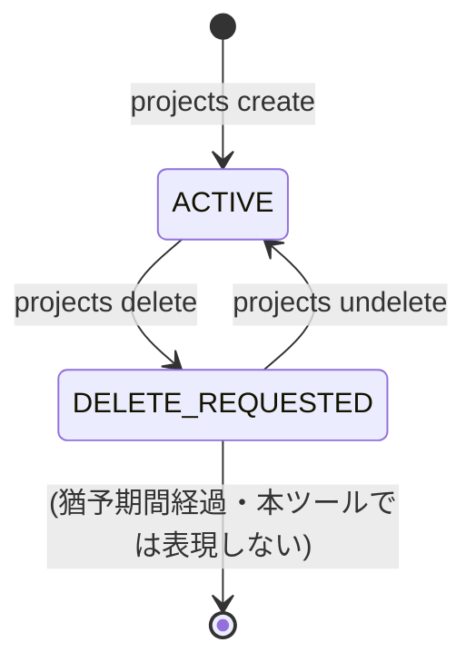
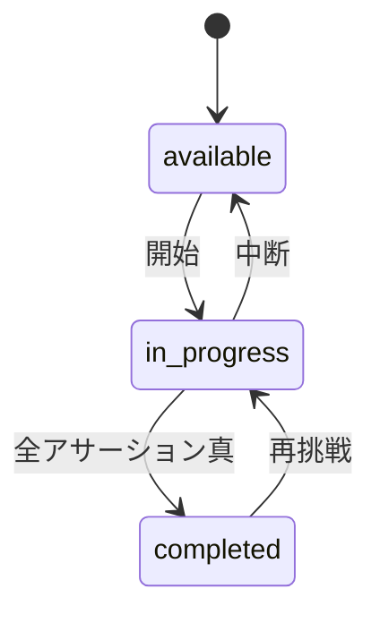
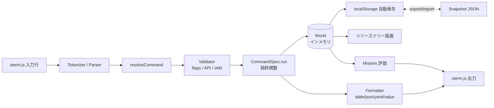

# gcloud-sim - 設計仕様書

## 1. 概要

gcloud-sim は、ブラウザだけで動作する **gcloud CLI の学習用エミュレータ**である。Google Cloud Associate Cloud Engineer（ACE）の出題範囲に登場する gcloud / gcloud storage / kubectl 相当の操作を、課金なし・アカウントなしで「打ったら結果が返る」形で体験できるようにする。GitHub Pages に静的サイトとして公開し、自由操作を主軸に、オプションとしてミッション形式の演習も提供する。

> 本プロジェクトは Google 非公式の学習用ツールであり、本物の Google Cloud には一切接続しない。

## 2. 背景と課題

### 2.1 現状

- ACE 試験では、gcloud コマンドのサブコマンド・フラグの細かい差異や、IAM の階層と継承を踏まえた「最小権限の付け方」が問われる。
- Foundational レベル（CDL / Generative AI Leader）は知識中心で合格できたが、ACE は Console と CLI で実際に操作した経験の有無が正答率に直結する。
- 既存のローカル GCP エミュレータ（`gcloud emulators`、fake-gcs-server、floci-gcp など）はアプリ開発向けのデータプレーン API を対象としており、プロジェクト・請求・IAM・VPC・Compute Engine といった **管理側の操作** はほぼ再現できない。

### 2.2 課題

- 手を動かさずに問題集だけで学ぶと、選択肢の gcloud コマンドがどれも「それっぽく」見えて識別できない。
- 本物の GCP に触るには無料トライアルや Cloud Shell が必要で、課金・環境構築・後片付けの心理的コストがある。
- ACE の出題範囲を横断してコマンド操作を試せる場が存在しない。

### 2.3 この設計で解決すること

| ビフォー | アフター |
|:---------|:---------|
| コマンドを文字で暗記するしかない | ブラウザでコマンドを打ち、成功・失敗のフィードバックを即座に得られる |
| IAM の継承を図で読むだけ | `PERMISSION_DENIED` を体験し、どの階層にどのロールを付ければ通るかを試行錯誤できる |
| 本物の GCP に触るには準備が必要 | URL を開くだけで開始できる。状態は localStorage に保存され、JSON で持ち出せる |

## 3. スコープ

### 3.1 対象

- **コマンド範囲**: ACE 試験ガイドの5ドメインを一通りカバーする（Associate レベルまで）
  - 環境セットアップ: プロジェクト・請求アカウント・`gcloud config` / configurations
  - 計画と構成: マシンタイプ・リージョン/ゾーン・料金試算に関わる `list` / `describe` 系
  - デプロイと実装: Compute Engine、GKE（`gcloud container` + 主要な `kubectl`）、Cloud Run、Cloud Functions、App Engine、Cloud Storage（`gcloud storage`）、VPC / サブネット / ファイアウォール、Cloud SQL の作成
  - 運用の維持: インスタンスの start/stop/delete、スナップショット、ログ・モニタリングの `list` 系、`gcloud operations`
  - アクセスとセキュリティ: IAM ポリシー（組織・フォルダ・プロジェクト・リソース）、サービスアカウント、ロール一覧、`gcloud auth`（疑似）
- **UI（Phase 1）**: xterm.js によるターミナル、リソースツリー表示、ミッションパネル（オプション）、設定パネル（reset / export / import）
- **Console 風 GUI（Phase 2）**: 同じ World を操作する第2の UI。本物の Google Cloud Console の **ナビゲーション構造と主要フォームの項目** を再現し、見た目の忠実度は追わない（DJ-011）。対象画面は以下に限定する。
  - IAM と管理: IAM（プリンシパル・ロール一覧、継承元の表示）、サービスアカウント
  - Compute Engine: VM インスタンス一覧、VM 作成フォーム（マシンタイプ・ブートディスク・サービスアカウント・アクセススコープ・ネットワークタグ・プリエンプティブル/Spot）
  - VPC ネットワーク: ファイアウォールルール一覧・作成フォーム、サブネット一覧
  - Cloud Storage: バケット一覧、バケット作成フォーム（ロケーション・ストレージクラス・アクセス制御）
  - お支払い: 予算とアラートの作成フォーム
  - Cloud Run / Kubernetes Engine: 一覧のみ
  - 各作成フォームに「同等のコマンドライン」表示（フォーム入力から gcloud コマンドを生成）
- **状態管理**: 全リソースをブラウザ内のインメモリ状態として保持し、localStorage に自動保存。JSON の export / import。
- **ミッション**: 自由操作の上に乗るオプション機能。状態に対するアサーションでクリア判定する。
- **配信**: GitHub Actions でビルドし GitHub Pages に公開。

### 3.2 対象外

- 本物の Google Cloud API への接続、認証、課金。
- Google Cloud Console の **見た目の忠実な再現**、および 3.1 に列挙した以外の画面。Console 風 GUI は構造と主要フォームの再現に留め、Phase 1 では実装しない。
- Professional レベルの試験範囲（Cloud Architect 等）に固有の高度な機能。
- gcloud の全コマンド・全フラグの網羅。ACE 頻出の範囲に限定し、未対応は明示的にエラーとする（DJ-005）。
- 実行時間・料金の正確なシミュレーション。料金はあくまで参考値として扱うか、初期バージョンでは扱わない。
- 複数ユーザーでの共有、サーバー側の進捗保存、ランキング。
- 日本語以外の UI 言語（初期バージョン）。コマンド出力は本物に合わせて英語。

### 3.3 境界条件

| 境界 | 内側（この設計の責務） | 外側（他の責務） |
|:-----|:--------------------|:---------------|
| コマンド解釈 | 入力文字列のトークナイズ、コマンド解決、フラグ検証、状態更新、出力生成 | 本物の gcloud の挙動そのもの（公式リファレンスを正とし、差異は TBD として記録） |
| 状態の永続化 | localStorage への保存・復元、JSON の export / import、スキーマバージョン管理 | ブラウザ外でのバックアップ、クラウド同期 |
| UI | xterm.js の入出力、リソースツリー、ミッションパネル | OS のターミナル、シェルの機能（パイプ・リダイレクトは対象外） |
| Console 風 GUI | ナビゲーション構造、一覧画面、主要な作成フォーム、同等コマンドの生成 | 本物の Console の見た目・アニメーション・全画面の網羅 |
| 学習コンテンツ | ミッション定義（JSON）とクリア判定 | 試験問題の提供、解説記事 |

## 4. 用語定義

| 用語 | 定義 | コード上の表現 |
|:-----|:-----|:-------------|
| エンジン | UI に依存しない純粋な TS モジュール。状態とコマンドを受け取り、新しい状態と出力を返す | `src/engine/` |
| Console ビュー | World を Google Cloud Console 風に表示・操作する第2の UI（Phase 2） | `src/ui/console/` |
| 同等コマンド | GUI フォームの入力内容から生成される gcloud コマンド文字列 | `toEquivalentCommand()` |
| ワールド | エミュレータが保持する全リソースの集合（組織〜リソース、config、principal を含む） | `World` |
| コマンド定義 | サブコマンドの名前・フラグ・実行関数・出力整形を宣言的に記述したもの | `CommandSpec` |
| コマンド解決 | トークン列から `CommandSpec` を特定する処理 | `resolveCommand()` |
| プリンシパル | 現在コマンドを実行しているとみなされる主体（ユーザーまたはサービスアカウント） | `Principal`、`world.session.principal` |
| リソース階層 | Organization → Folder → Project → Resource の親子関係 | `ResourceHierarchy` |
| IAM バインディング | ロールとメンバー集合の組。ポリシーはバインディングの配列 | `IamBinding`、`IamPolicy` |
| 有効権限 | 階層を遡って継承したバインディングを合成し、プリンシパルが持つ権限の集合 | `resolveEffectivePermissions()` |
| オペレーション | 非同期処理を表す疑似オブジェクト（インスタンス作成等）。`gcloud compute operations list` に対応 | `Operation` |
| 出力フォーマッタ | `--format` に応じて結果を table / json / yaml / value に整形する | `Formatter` |
| ミッション | 目標文とアサーションの組。状態を検査してクリアを判定する | `Mission`、`MissionAssertion` |
| スナップショット | export / import で扱う、ワールドとミッション進捗を含む JSON | `Snapshot` |
| 未対応コマンド | 解決できたがエミュレータが実装していないコマンド。明示的にエラーとする | `ERR_NOT_IMPLEMENTED` |

## 5. 設計判断

### DJ-001: 完全にブラウザ内で完結させる（バックエンドなし）

- **判断内容**: エミュレータの全処理をブラウザ上の TypeScript で実装し、サーバーを持たない。
- **理由**: GitHub Pages で無料公開でき、利用者はアカウント登録も課金も不要。学習ツールとして「URL を開けば始められる」ことを最優先する。
- **検討した代替案**:
  - Docker で動くローカルエミュレータ（floci-gcp 方式）: 管理系操作の再現に向かず、環境構築の手間が学習の障壁になる → 不採用
  - Cloud Functions 等のバックエンド + フロント: 運用コストと課金が発生し、目的（課金なし）に反する → 不採用
- **トレードオフ**: 状態の保存先がブラウザに限定される。複数端末での同期は export / import で代替する。
- **影響範囲**: DJ-007（永続化）、11.2（セキュリティ）、12（制約）

### DJ-002: エンジンと UI を分離し、エンジンは純粋関数で構成する

- **判断内容**: `engine` は `(world, input) => { world, output }` 型の純粋な処理とし、DOM や xterm.js に依存しない。UI はエンジンの結果を描画するだけにする。
- **理由**: コマンドごとの単体テストを Vitest で書ける。本物の gcloud と出力を突き合わせるテストが「誤学習を防ぐ」最重要の品質保証になる（DJ-005 と対）。将来 CLI 版や別 UI を作る余地も残る。
- **検討した代替案**:
  - UI コンポーネント内で直接状態を更新する: 実装は速いがテスト不能で、コマンドが増えるほど破綻する → 不採用
- **トレードオフ**: 初期の骨組み作成に手間がかかる。
- **影響範囲**: 6（ドメインモデル）、9（データフロー）、ファイル構成全般

### DJ-003: コマンドは宣言的な `CommandSpec` のテーブルとして定義する

- **判断内容**: 各サブコマンドを、コマンドパス（例: `["compute", "instances", "create"]`）、位置引数、フラグ定義（名前・型・必須・デフォルト・選択肢）、実行関数、出力整形の宣言オブジェクトとして登録する。パーサとバリデータは共通化する。
- **理由**: ACE 範囲でコマンドは数十〜百程度になる。共通の解釈・検証・ヘルプ生成（`--help`）を1か所に集約しないと一貫性が保てない。フラグの誤りを「本物と同じ形式のエラー」で返す仕組みも共通化できる。
- **検討した代替案**:
  - コマンドごとに手書きパーサ: 柔軟だが重複と表記ゆれが増え、`--help` の自動生成もできない → 不採用
  - 本物の gcloud の CLI ツリー（`gcloud meta` 相当の JSON）を丸ごと取り込む: 網羅性は高いが巨大で、未対応コマンドを「対応済み」に見せる危険がある → 不採用（ただし、フラグ名の照合用データとしての将来利用は TBD-002）
- **トレードオフ**: 表現力が制限されるため、特殊な構文（`--metadata=key=value,...` など）は型としてサポートを追加する必要がある。
- **影響範囲**: 6.2（CommandSpec）、7（UC-001）、10（フラグ系エラー）

### DJ-004: ターミナル UI に xterm.js を採用する

- **判断内容**: 入出力に xterm.js を使い、行編集・履歴（↑↓）・Tab 補完・`Ctrl+C` / `Ctrl+L` を提供する。
- **理由**: 本物の Cloud Shell に近い操作感が学習効果に直結する。ANSI カラーで警告・エラーを本物同様に表現できる。
- **検討した代替案**:
  - 自作の input + ログ表示: 依存が減り軽量だが、行編集や補完を自前実装すると結局コストが高い → 不採用
- **トレードオフ**: 依存が1つ増える。バンドルサイズが増える。バージョン固定と lockfile 管理を徹底する（11.2）。
- **影響範囲**: UI 層、11.1（初期ロード）

### DJ-005: 未対応コマンドは「それっぽく成功させない」で明示的にエラーにする

- **判断内容**: 解決できないコマンド・フラグは本物と同形式の `ERROR: (gcloud...) unrecognized arguments` 等で返す。対応予定だが未実装のコマンドは `gcloud-sim: command not implemented yet: ...` と、本物には存在しないメッセージで返し、混同させない。
- **理由**: 最大のリスクは「本物と違うコマンド・出力を覚えてしまうこと」。曖昧に成功させるより、はっきり「対応していない」と伝えるほうが学習ツールとして誠実である。
- **検討した代替案**:
  - 未知のコマンドを汎用的に「成功」扱い: 触った感は出るが誤学習を生む → 不採用
- **トレードオフ**: 対応範囲の狭さがユーザーに見える。対応コマンド一覧をドキュメントとして公開して補う。
- **影響範囲**: 10（E-001, E-002, E-003）、`--help` 出力

### DJ-006: IAM は「現在のプリンシパル」を切り替えて有効権限を評価する

- **判断内容**: ワールドに `session.principal` を持ち、`gcloud auth login <email>`（疑似）や `gcloud config set account` で切り替えられる。各コマンドは必要な権限（例: `compute.instances.create`）を宣言し、実行前に階層継承を含めた有効権限で判定する。デフォルトのプリンシパルは組織の Owner 相当とし、初心者は権限を意識せずに操作できる。
- **理由**: ACE で最も点差が付くのが IAM の継承と最小権限。「権限が足りない → 適切な階層にロールを付ける → 通る」を体験できることが本ツールの核心的価値。
- **検討した代替案**:
  - IAM を保存するだけで評価はしない: 実装は容易だが `PERMISSION_DENIED` の体験ができない → 不採用
  - 本物のロール定義（数千の権限）を完全再現: データ量が過大 → 不採用。ACE 頻出の事前定義ロール約30個と、それが含む代表的権限のみを収録する
- **トレードオフ**: ロール→権限の対応が本物の部分集合になる。収録外の権限判定は「許可」に倒す（学習を止めないため）。この方針は `--help` と README に明記する。
- **影響範囲**: 6（IamPolicy, Role, Principal）、7（UC-004）、10（E-006）

### DJ-007: 永続化は localStorage の自動保存 + JSON の export / import

- **判断内容**: コマンド実行ごとにワールドをシリアライズして localStorage に保存する。設定パネルから Snapshot JSON の export / import ができる。Snapshot には `schemaVersion` を含め、import 時にマイグレーションまたは拒否を行う。
- **理由**: リロードで消えると学習が続かない。export / import があれば端末間の持ち運びや「ハマった状態の共有」ができる。
- **検討した代替案**:
  - IndexedDB: 容量は大きいが、ワールドは数百 KB 程度で localStorage で足りる。API が複雑 → 現時点では不採用（容量超過が顕在化したら移行、TBD-004）
  - 保存しない: 最も単純だが学習継続性を損なう → 不採用
- **トレードオフ**: localStorage の容量上限（一般に 5MB 程度）。ブラウザのプライベートモードでは保存されない。
- **影響範囲**: 6（Snapshot）、7（UC-005）、10（E-010, E-011）

### DJ-008: 非同期オペレーションは「状態遷移 + 疑似オペレーション」で表現し、実時間は待たせない

- **判断内容**: インスタンス作成などは即座に `Operation` を生成して完了させ、リソースは `PROVISIONING → STAGING → RUNNING` の遷移を経た最終状態として保存する。`gcloud compute operations list` で履歴が見える。`--async` フラグの有無で出力形式（オペレーション情報 vs リソース情報）を切り替える。
- **理由**: 本物は数十秒待つが、学習ツールで待たせる意味はない。一方で「状態が遷移する」「オペレーションが残る」概念は試験で問われるため、モデルとしては保持する。
- **検討した代替案**:
  - setTimeout で実時間の遷移を再現: 臨場感はあるが学習効率を下げ、エンジンの純粋性（DJ-002）を壊す → 不採用（設定でオプション化する余地を TBD-005 に残す）
- **トレードオフ**: 「作成直後に describe すると PROVISIONING」のような本物の挙動は再現されない。
- **影響範囲**: 8（状態遷移）、6（Operation）

### DJ-009: 出力フォーマットは本物の gcloud のデフォルト table を第一に、`--format=json|yaml|value(...)` を共通実装する

- **判断内容**: 各コマンドは「結果オブジェクト」を返し、`Formatter` が `--format` に従って整形する。デフォルトは本物と同じ列構成の table。`--format=json` は本物の API リソース表現に近いキー名で出力する。`--filter` は等価比較と `:` 部分一致の簡易版のみ対応する。
- **理由**: 試験では `--format` や `--filter` の使い方も問われる。整形を共通化しないとコマンドごとに出力がばらつく。
- **検討した代替案**:
  - 各コマンドが文字列を直接返す: 簡単だが `--format` を全コマンドで実装し直すことになる → 不採用
- **トレードオフ**: 本物の projection / transform 構文の完全再現はしない。
- **影響範囲**: 9.2（データ変換）、6（CommandResult）

### DJ-010: ミッションは JSON 定義 + 状態アサーションで実装し、自由操作の上にオプションとして乗せる

- **判断内容**: ミッションは `title / description / hints / assertions[]` を持つ JSON として `src/missions/` に置く。アサーションはワールドに対する述語（例: `instanceExists({ name, zone, machineType })`）の宣言で表現し、コマンド実行のたびに評価する。ミッションパネルは閉じていてもエミュレータは完全に動く。
- **理由**: 主軸は自由操作。ミッションはコンテンツとして後から追加しやすい形にしておき、エンジンに手を入れずに増やせるようにする。
- **検討した代替案**:
  - 「特定のコマンド文字列を打ったか」で判定: 別解（同じ結果になる別のコマンド）を弾いてしまう → 不採用
- **トレードオフ**: 述語の種類を増やすたびにエンジン側の実装が必要。
- **影響範囲**: 6（Mission）、7（UC-006）、8（Mission の状態）

### DJ-011: Console 風 GUI は World を共有する第2の UI とし、「構造の再現」に留める（Phase 2）

- **判断内容**: Console ビューはエンジンの公開 API（`applyAction()`、World の読み取り）だけを使い、CLI と同じ World を表示・操作する。GUI からの操作は内部的に CLI と同じコマンド実行経路（`CommandSpec.run`）を通す。再現するのは左ナビのメニュー階層・一覧画面の列・作成フォームの項目名と選択肢までで、本物の配色やレイアウトは模倣しない。各作成フォームには「同等のコマンドライン」を表示する。
- **理由**: ACE では「Console のどこで何を設定するか」「フォームにどの選択肢があるか」を問うシナリオ問題が多く、CLI 問題より比重が大きい。一方、Console の見た目は頻繁に変わるため、忠実に追うと保守不能になる。構造だけを再現すれば試験対策としての価値を保ちつつ、変更への追従コストを抑えられる。GUI 操作を CLI と同じ経路に通すことで、権限チェックやバリデーションを二重実装せずに済み、「GUI で付けたロールが CLI に効く」往復も自然に成立する。「同等のコマンドライン」は本物の Console にもある機能で、GUI と CLI の対応を一度に覚えられる。
- **検討した代替案**:
  - Console を丸ごと再現する: 画面数が膨大で、個人開発では完成しない → 不採用
  - GUI を作らず CLI のみ: 実装は最小だが、試験の出題比重に対してカバー範囲が偏る → 不採用（Phase 1 としては採用し、Phase 2 で GUI を追加）
  - GUI 専用の状態管理を持つ: 実装は独立して進めやすいが、CLI との整合が崩れ、権限チェックが二重になる → 不採用
- **トレードオフ**: 本物と画面の見た目が異なるため「Console の雰囲気に慣れる」効果は限定的。フォームの項目は本物のあるバージョン時点のものを基準にし（TBD-001 と同様）、差異は README に記載する。
- **影響範囲**: 3（スコープ）、7（UC-008）、12（制約）、TBD-010

## 6. ドメインモデル

### 6.1 モデル図

### 6.2 エンティティ定義

#### World

| 属性 | 型 | 必須 | 説明 | 制約 |
|:-----|:---|:-----|:-----|:-----|
| schemaVersion | number | Yes | Snapshot 互換性のためのバージョン | 単調増加 |
| hierarchy | ResourceHierarchy | Yes | 組織・フォルダ・プロジェクトとその配下のリソース | ルートは Organization 1つ |
| config | GcloudConfig | Yes | `gcloud config` の設定群（configurations 複数） | `default` 構成が必ず存在 |
| session | Session | Yes | 現在のプリンシパルとアクティブな configuration | principal は既知のメンバーである |
| operations | Operation[] | Yes | 実行済みオペレーションの履歴 | 上限 500 件で古いものから削除 |
| missions | Mission[] | Yes | ミッション定義と進捗 | id ユニーク |

**不変条件**:
- `config.configurations[session.activeConfiguration]` が存在する。
- `config` の `core/project` が設定されている場合、その projectId は hierarchy 内に存在するか、または「存在しないプロジェクト」として明示的に警告を出す（本物と同じく設定自体は許容する）。

#### Project

| 属性 | 型 | 必須 | 説明 | 制約 |
|:-----|:---|:-----|:-----|:-----|
| projectId | string | Yes | グローバルユニークな ID | 6〜30 文字、小文字英字始まり、`[a-z0-9-]`、末尾ハイフン不可 |
| name | string | Yes | 表示名 | 4〜30 文字 |
| projectNumber | string | Yes | 自動採番の数値文字列 | 12 桁、変更不可 |
| parent | ParentRef | Yes | `{ type: 'organization' \| 'folder', id }` | 存在する親を指す |
| lifecycleState | ProjectState | Yes | `ACTIVE` / `DELETE_REQUESTED` | 8 章参照 |
| billingAccountId | string | No | リンク済み請求アカウント | 存在する BillingAccount、`open === true` |
| enabledApis | string[] | Yes | 有効化済み API（`compute.googleapis.com` 等） | 重複なし |
| iamPolicy | IamPolicy | Yes | プロジェクトレベルのポリシー | — |

**不変条件**:
- projectId は World 全体でユニーク。削除要求後も再利用不可（本物の 30 日猶予を「再利用不可」として単純化）。
- Compute Engine 系のリソースを作成するには `compute.googleapis.com` が enabledApis に含まれ、かつ billingAccountId が設定されている（E-007, E-008）。

#### IamPolicy / IamBinding

| 属性 | 型 | 必須 | 説明 | 制約 |
|:-----|:---|:-----|:-----|:-----|
| bindings | IamBinding[] | Yes | ロールごとのメンバー集合 | 同一 role のバインディングは1つに統合 |
| role | string | Yes | `roles/viewer`、`roles/compute.admin` 等 | Role カタログに存在するか、`projects/{id}/roles/{name}` のカスタムロール |
| members | string[] | Yes | `user:`、`serviceAccount:`、`group:`、`domain:`、`allUsers`、`allAuthenticatedUsers` | プレフィックス必須（E-009） |

**不変条件**:
- 各リソースのポリシーは、そのリソース自身のバインディングのみを持つ。継承は評価時（`resolveEffectivePermissions`）に階層を遡って行い、ポリシーにはコピーしない。
- `roles/owner` を持つメンバーが Organization レベルに最低1人存在する（デフォルトプリンシパルを閉め出さないため。削除しようとした場合は E-012）。

#### Instance

| 属性 | 型 | 必須 | 説明 | 制約 |
|:-----|:---|:-----|:-----|:-----|
| name | string | Yes | インスタンス名 | 1〜63 文字、RFC1035、ゾーン内ユニーク |
| zone | string | Yes | `asia-northeast1-a` 等 | ゾーンカタログに存在 |
| machineType | string | Yes | `e2-medium` 等 | マシンタイプカタログに存在 |
| status | InstanceStatus | Yes | 8 章参照 | — |
| networkInterfaces | NetworkInterface[] | Yes | network / subnet / 内部 IP / 外部 IP（任意） | 少なくとも1つ。subnet は zone の region に属する |
| disks | AttachedDisk[] | Yes | ブートディスクを含む | ブートディスクはちょうど1つ |
| tags | string[] | No | ネットワークタグ。FirewallRule の targetTags と照合 | — |
| serviceAccount | string | No | アタッチされた SA のメール | Project 内の SA、または default compute SA |
| scopes | string[] | No | アクセススコープ | — |
| preemptible / spot | boolean | No | 試験頻出の属性 | 併用不可 |

**不変条件**:
- `(zone, name)` はプロジェクト内でユニーク。
- `status === 'RUNNING'` のインスタンスは `stop` / `suspend` / `delete` 可能、`TERMINATED` のインスタンスは `start` / `delete` のみ可能。

#### Bucket

| 属性 | 型 | 必須 | 説明 | 制約 |
|:-----|:---|:-----|:-----|:-----|
| name | string | Yes | グローバルユニーク | 3〜63 文字、小文字・数字・ハイフン・ドット、`goog` 始まり不可 |
| location | string | Yes | `ASIA-NORTHEAST1`、`ASIA`、`US` 等 | ロケーションカタログ |
| storageClass | string | Yes | `STANDARD` / `NEARLINE` / `COLDLINE` / `ARCHIVE` | — |
| uniformBucketLevelAccess | boolean | Yes | 均一なバケットレベルのアクセス | true の場合 ACL 操作は E-013 |
| lifecycleRules | LifecycleRule[] | No | `gcloud storage buckets update --lifecycle-file` 相当 | — |
| objects | StorageObject[] | Yes | `gcloud storage cp` の疑似結果。内容は保持せずメタデータのみ | name はバケット内ユニーク |

**不変条件**:
- バケット名は World 全体（全プロジェクト横断）でユニーク。

#### Operation

| 属性 | 型 | 必須 | 説明 | 制約 |
|:-----|:---|:-----|:-----|:-----|
| id | string | Yes | `operation-{timestamp}-{random}` | ユニーク |
| operationType | string | Yes | `insert` / `delete` / `start` / `stop` 等 | — |
| targetLink | string | Yes | 対象リソースの疑似 selfLink | — |
| status | `PENDING` \| `RUNNING` \| `DONE` | Yes | DJ-008 により保存時は常に `DONE` | — |
| error | string | No | 失敗時のメッセージ | — |
| insertTime / endTime | string(ISO) | Yes | 時刻 | endTime ≥ insertTime |

#### CommandSpec（エンジン内の定義。永続化しない）

| 属性 | 型 | 必須 | 説明 |
|:-----|:---|:-----|:-----|
| path | string[] | Yes | `["compute", "instances", "create"]` |
| positionals | PositionalSpec[] | Yes | 位置引数（名前・必須・複数可） |
| flags | FlagSpec[] | Yes | 名前・型（string/bool/list/keyvalue/enum）・必須・デフォルト・choices・説明 |
| requiredPermissions | string[] | Yes | 実行に必要な IAM 権限（DJ-006） |
| requiredApis | string[] | No | 有効化が必要な API |
| run | `(ctx, args) => CommandResult` | Yes | 純粋な実行関数 |
| defaultFormat | TableSpec | No | table 出力の列定義 |
| implemented | boolean | Yes | false の場合 `ERR_NOT_IMPLEMENTED`（DJ-005） |

#### Mission

| 属性 | 型 | 必須 | 説明 | 制約 |
|:-----|:---|:-----|:-----|:-----|
| id | string | Yes | `m-compute-001` 等 | ユニーク |
| domain | string | Yes | ACE の5ドメインのいずれか | enum |
| title / description | string | Yes | 目標文（日本語） | — |
| hints | string[] | No | 段階的ヒント | — |
| setup | WorldPatch | No | 開始時にワールドへ適用する初期状態（権限を削っておく等） | — |
| assertions | MissionAssertion[] | Yes | 全て真でクリア | 1つ以上 |
| status | MissionStatus | Yes | 8 章参照 | — |

### 6.3 エンティティ間の関係

| 関係 | 多重度 | 説明 | 制約 |
|:-----|:-------|:-----|:-----|
| Organization → Folder / Project | 1:N | リソース階層のルート | 組織削除は対象外 |
| Folder → Folder / Project | 1:N | ネストは 10 階層まで（本物準拠） | フォルダ削除は配下が空のときのみ |
| Project → 各リソース | 1:N | プロジェクトが所有 | `projects delete` は配下リソースをカスケード削除（DELETE_REQUESTED 化） |
| Project → BillingAccount | N:1 | リンク | 請求アカウント未リンクでは課金対象 API を有効化できない |
| Network → Subnet / FirewallRule | 1:N | VPC が所有 | サブネットが残る Network は削除不可 |
| Instance → Subnet | N:1 | networkInterfaces 経由 | zone の region と subnet の region が一致 |
| Instance → ServiceAccount | N:1 | アタッチ | 任意 |
| FirewallRule → Instance | N:N（tag 経由） | targetTags で対象を決定 | 実際の通信は再現しない |
| World → Operation | 1:N | 履歴 | 上限 500 |

## 7. 振る舞い仕様

### UC-001: コマンドを実行する

**トリガー**: ユーザーがターミナルで Enter を押す

**事前条件**:
- World がロード済み（初期状態または localStorage からの復元）

**正常フロー**:
1. 入力行をトークナイズする（クォート、`--flag=value` / `--flag value`、`--no-flag` を解釈）
2. 先頭トークンでツール（`gcloud` / `kubectl` / `gsutil`）を判定する
3. `resolveCommand()` でコマンドパスを最長一致で解決する
4. `CommandSpec.implemented` を確認する
5. 位置引数とフラグをバリデーションする（必須・型・choices・未知フラグ）
6. `requiredApis` と `requiredPermissions` を検証する（DJ-006）
7. `run()` を実行し、新しい World と `CommandResult` を得る
8. `Formatter` で `--format` / `--filter` に応じて出力文字列に整形する
9. 新しい World を localStorage に保存する（UC-005 の自動保存部分）
10. ミッションのアサーションを評価し、クリアがあれば通知する（UC-006）
11. 出力をターミナルに書き、リソースツリーを再描画する

**事後条件**:
- World は保存済みで、ターミナルと UI の表示が World と一致する

**代替フロー**:
- `--help` または `-h` が含まれる: 実行せず `CommandSpec` からヘルプを生成して表示する
- `--async` が付いている: リソースの代わりに Operation を出力する（DJ-008）
- `--quiet` / `-q` が付いていない破壊的操作（delete 等）: 確認プロンプト `Do you want to continue (Y/n)?` を表示し、`y` / Enter で続行、`n` で `Aborted by user.`

**例外フロー**:
- ステップ 3 で解決失敗: E-001
- ステップ 4 で未実装: E-002
- ステップ 5 でフラグエラー: E-003 / E-004
- ステップ 6 で API 未有効化: E-007、権限不足: E-006
- ステップ 7 でリソース系エラー: E-005 / E-008 など
- ステップ 9 で保存失敗: E-010（コマンド自体は成功扱い、警告を表示）

### UC-002: 作業対象プロジェクトを切り替える

**トリガー**: `gcloud config set project <id>` または `gcloud config configurations activate <name>`

**正常フロー**:
1. アクティブ configuration の `core/project` を更新する
2. `Updated property [core/project].` を出力する

**代替フロー**:
- 指定 projectId が hierarchy に存在しない: 本物と同様に設定は成功させ、警告 `WARNING: You do not appear to have access to project [...] or it does not exist.` を出す
- `configurations create <name>` → 新規作成してアクティブ化。`--no-activate` でアクティブ化しない

**例外フロー**:
- `configurations activate` で存在しない名前: E-005（`configuration not found`）

### UC-003: Compute Engine インスタンスを作成する

**トリガー**: `gcloud compute instances create <name> [--zone --machine-type --image-family --image-project --network --subnet --tags --service-account --scopes --preemptible --provisioning-model --metadata ...]`

**事前条件**:
- `core/project` が設定済み、または `--project` 指定
- プロジェクトに Compute API が有効で、請求アカウントがリンク済み
- プリンシパルが `compute.instances.create` を持つ

**正常フロー**:
1. zone を決定する（フラグ → `compute/zone` 設定 → 未設定なら E-004 相当の対話プロンプトの代わりに、本物同様の「zone を選べ」プロンプトをエラーとして返す）
2. machineType のデフォルトを `e2-medium` とする
3. network / subnet を解決する（未指定なら `default` ネットワークの当該 region のサブネット）
4. `(zone, name)` の重複を確認する
5. Instance を `RUNNING` 状態で生成し、内部 IP と外部 IP（`--no-address` でない限り）を採番する
6. Operation（`insert`, `DONE`）を追加する
7. `Created [https://www.googleapis.com/compute/v1/projects/.../zones/.../instances/...].` と、`NAME ZONE MACHINE_TYPE PREEMPTIBLE INTERNAL_IP EXTERNAL_IP STATUS` の table を出力する

**事後条件**:
- Instance が list / describe で取得できる

**代替フロー**:
- `--async`: Operation の情報のみ出力
- `--preemptible` または `--provisioning-model=SPOT`: 該当フラグを Instance に反映

**例外フロー**:
- 名前重複: E-008
- zone / machineType がカタログに無い: E-005（`Could not fetch resource: ... was not found`）
- `default` ネットワークが削除済みで `--network` 未指定: E-005
- subnet の region と zone の region の不一致: E-014

### UC-004: IAM バインディングを追加し、権限不足を解消する（本ツールの核心）

**トリガー**: `gcloud projects add-iam-policy-binding <project> --member=<member> --role=<role>`（同様に `organizations` / `resource-manager folders`、`storage buckets add-iam-policy-binding`）

**事前条件**:
- プリンシパルが対象リソースで `resourcemanager.projects.setIamPolicy`（等）を持つ

**正常フロー**:
1. member のプレフィックスと role の存在を検証する
2. 対象リソースの IamPolicy に binding を追加（同 role があれば members に追記）する
3. 更新後のポリシーを YAML で出力する（本物準拠）

**事後条件**:
- 以降、そのメンバーとしてコマンドを実行すると、継承を含めた有効権限に反映される

**代替フロー（学習シナリオ）**:
1. ユーザーが `gcloud config set account dev@example.com` でプリンシパルを切り替える
2. `gcloud compute instances create ...` を実行 → E-006（`PERMISSION_DENIED`、不足権限名を含む）
3. ユーザーが Owner に戻り、フォルダまたはプロジェクトに `roles/compute.instanceAdmin.v1` を付与する
4. 再度 dev で実行 → 成功。リソースツリーのポリシー表示で「どこから継承されたか」が分かる

**例外フロー**:
- role が未知: E-009
- member のプレフィックス不正: E-009
- 最後の Organization Owner を `remove-iam-policy-binding` で削除: E-012

### UC-005: 状態を保存・復元・持ち出す

**トリガー**: コマンド実行（自動保存）、設定パネルの Export / Import / Reset ボタン

**正常フロー（自動保存）**:
1. World を `JSON.stringify` し、`gcloud-sim:world:v{schemaVersion}` キーに保存する
2. 失敗時は E-010 を警告として表示し、続行する

**正常フロー（Export）**:
1. `{ schemaVersion, exportedAt, world, missions }` の Snapshot を生成する
2. `gcloud-sim-snapshot-{YYYYMMDD-HHmm}.json` としてダウンロードする

**正常フロー（Import）**:
1. ファイルを読み JSON としてパースする
2. `schemaVersion` を確認し、現行と一致なら置換、旧バージョンならマイグレーション関数を順に適用する
3. 不変条件を検証し、通れば World を置換して保存する。置換前に「現在の状態を上書きします」と確認する

**正常フロー（Reset）**:
1. 確認ダイアログの後、初期 World（サンプル組織・フォルダ2つ・プロジェクト2つ・請求アカウント1つ・default ネットワーク）を生成して保存する

**例外フロー**:
- JSON パース失敗・schemaVersion 不明・不変条件違反: E-011（既存の状態は変更しない）
- localStorage 容量超過: E-010

### UC-006: ミッションに挑戦する（オプション）

**トリガー**: ミッションパネルで「開始」を押す

**正常フロー**:
1. `setup` があれば World に適用する（例: プリンシパルの権限を一部剥奪）
2. Mission を `in_progress` にする
3. 以降、コマンド実行のたびに `assertions` を評価し、全て真なら `completed` にしてターミナルに祝福メッセージを出す

**代替フロー**:
- ユーザーが「ヒント」を押す: 次のヒントを1つ開示する
- ユーザーが「中断」を押す: `available` に戻す。World の変更は残す（自由操作優先）

**例外フロー**:
- `setup` の適用が不変条件に違反する（ミッション定義のバグ）: E-015 として開発者向けにコンソールへ出し、ミッションは開始しない

### UC-007: リソース階層とポリシーを可視化する

**トリガー**: コマンド実行後の再描画、ツリーのノードクリック

**正常フロー**:
1. hierarchy を Organization → Folder → Project → リソース種別 → リソースのツリーとして描画する
2. ノード選択時に、そのリソースの IamPolicy と、上位から継承されるバインディング（継承元を明示）を表示する
3. 現在の `core/project` と `session.principal` をハイライトする

### UC-008: Console ビューから VM を作成し、同等コマンドを確認する（Phase 2）

**トリガー**: Console ビューで「Compute Engine → VM インスタンス → インスタンスを作成」を選び、フォームを送信する

**事前条件**:
- Console ビューが有効化されている（Phase 2 実装後）
- 選択中のプロジェクト（`core/project` と同期）とプリンシパルが設定されている

**正常フロー**:
1. フォームに名前・リージョン/ゾーン・マシンタイプ・ブートディスク・サービスアカウント・アクセススコープ・ネットワークタグ・プロビジョニングモデルを入力する
2. 入力のたびに `toEquivalentCommand()` が `gcloud compute instances create ...` を生成し、フォーム下部の「同等のコマンドライン」に表示する
3. 「作成」を押すと、生成したコマンドをエンジンの通常経路（UC-001 のステップ 3〜10）で実行する
4. 成功したら VM 一覧画面に遷移し、作成した VM を表示する。同時にターミナル側にも実行したコマンドと出力を（グレー表示で）記録する

**事後条件**:
- CLI の `gcloud compute instances list` で同じ VM が見える

**代替フロー**:
- 「同等のコマンドライン」の「コピー」を押す: クリップボードにコピーし、ターミナルに貼り付けて実行できる
- IAM 画面で「アクセス権を付与」: `add-iam-policy-binding` として同経路で実行し、継承元を含むロール一覧を再描画する

**例外フロー**:
- 権限不足: フォーム上部に E-006 と同じメッセージを赤帯で表示する（本物の Console と同様、エラー文言は API 由来）
- API 未有効化: 本物同様に「Compute Engine API を有効にする」ボタン付きの画面を出し、押すと `gcloud services enable compute.googleapis.com` を同経路で実行する
- バリデーションエラー（名前形式等）: フォーム項目の直下にエラーを表示し、送信しない

## 8. 状態遷移

### Instance の状態

| 遷移 | 開始状態 | 終了状態 | トリガー | ガード条件 | アクション |
|:-----|:---------|:---------|:---------|:----------|:----------|
| create | — | RUNNING（中間状態は即時通過） | `instances create` | 名前ユニーク、API 有効、権限あり | Operation(insert) 追加、IP 採番 |
| stop | RUNNING | TERMINATED | `instances stop` | 権限 `compute.instances.stop` | 外部 IP（エフェメラル）を解放、Operation(stop) |
| start | TERMINATED | RUNNING | `instances start` | 権限 `compute.instances.start` | 外部 IP を再採番、Operation(start) |
| suspend / resume | RUNNING ↔ SUSPENDED | — | `instances suspend` / `resume` | 権限 | Operation |
| delete | RUNNING / TERMINATED / SUSPENDED | 削除 | `instances delete` | 権限、確認プロンプト | ブートディスクは `--keep-disks` が無ければ同時削除、Operation(delete) |

**不正な遷移**:
- `TERMINATED` に対する `stop`: 本物同様にエラーではなく `Stopping instance(s)... done.` を返すが状態は変えない（本物の冪等挙動に合わせる）
- `RUNNING` に対する `start`: 同上、冪等
- `SUSPENDED` に対する `stop`: E-014（`Invalid state`）

### Project の状態

| 遷移 | 開始状態 | 終了状態 | トリガー | ガード条件 | アクション |
|:-----|:---------|:---------|:---------|:----------|:----------|
| create | — | ACTIVE | `projects create <id> [--organization\|--folder]` | projectId 形式、ユニーク、親に `resourcemanager.projects.create` | projectNumber 採番、作成者に `roles/owner` |
| delete | ACTIVE | DELETE_REQUESTED | `projects delete` | `resourcemanager.projects.delete`、確認 | 配下リソースはツリーから非表示、`projects list` に出ない |
| undelete | DELETE_REQUESTED | ACTIVE | `projects undelete` | 権限 | 配下リソース復活 |

**不正な遷移**:
- DELETE_REQUESTED のプロジェクトへの一切のリソース操作: E-005（`not found`、本物と同様）

### Mission の状態

**不正な遷移**:
- `completed` から `available` へは戻さない（履歴として残す）

## 9. データフロー

### 9.1 全体のデータフロー

### 9.2 データ変換ルール

| 入力 | 変換処理 | 出力 | バリデーション |
|:-----|:---------|:-----|:-------------|
| 入力行（string） | クォート処理、`--k=v` / `--k v` / `--no-k` の正規化、`--flag` の短縮形展開（`-q` → `--quiet`） | `Token[]` | 閉じられていないクォートは E-003 |
| `Token[]` | コマンドパスの最長一致。`gcloud beta` / `gcloud alpha` は接頭辞として無視し警告を出す | `CommandSpec` + 残余トークン | 一致なしは E-001 |
| 残余トークン | FlagSpec に従い型変換（list はカンマ分割、keyvalue は `k=v,k2=v2`、enum は choices 照合） | `ParsedArgs` | 必須欠落 E-004、未知フラグ E-003、choices 外 E-003 |
| `ParsedArgs` + World | `run()` によるリソース生成・更新 | `{ world, result }` | ドメイン不変条件（E-005〜E-014） |
| `CommandResult` | `--format` に従い整形。`--filter` は `key=value` / `key:substr` / `NOT` / `AND` の簡易版 | string | 未対応の projection は E-003 |
| World | `JSON.stringify` | localStorage 文字列 | 容量超過 E-010 |
| Snapshot JSON | schemaVersion 判定 → マイグレーション → 不変条件チェック | World | 失敗は E-011 |

## 10. エラー・例外設計

出力形式は本物の gcloud を踏襲する（`ERROR: (gcloud.compute.instances.create) ...`）。gcloud-sim 固有のエラーは `gcloud-sim:` プレフィックスを付け、本物と混同させない（DJ-005）。

| ID | エラー | 発生条件 | 深刻度 | 対処方針 | ユーザーへの影響 |
|:---|:-------|:---------|:-------|:---------|:---------------|
| E-001 | ERR_UNKNOWN_COMMAND | コマンドパスが解決できない | Low | 本物準拠 `ERROR: (gcloud) Invalid choice: 'xxx'.` + 近い候補を `Did you mean` で提示 | 再入力 |
| E-002 | ERR_NOT_IMPLEMENTED | 解決できたが `implemented: false` | Low | `gcloud-sim: command not implemented yet: gcloud xxx yyy` + 対応コマンド一覧へのリンク | 学習対象外だと分かる |
| E-003 | ERR_INVALID_FLAG | 未知フラグ、型不正、choices 外、クォート不正 | Low | 本物準拠 `ERROR: (gcloud.xxx) unrecognized arguments: --foo` / `argument --zone: Invalid choice` | 再入力 |
| E-004 | ERR_MISSING_ARGUMENT | 必須の位置引数・フラグ欠落（zone 未設定を含む） | Low | 本物準拠 `argument --member: Must be specified.`。zone 未設定時は本物の対話プロンプト相当のメッセージを表示し、`--zone` か `gcloud config set compute/zone` を案内 | 再入力 |
| E-005 | ERR_NOT_FOUND | 存在しないリソース・ゾーン・マシンタイプ・configuration を参照 | Low | 本物準拠 `ERROR: ... The resource 'projects/p/zones/z/instances/i' was not found` | 再入力 |
| E-006 | ERR_PERMISSION_DENIED | プリンシパルが必要権限を持たない | Medium | 本物準拠 `ERROR: ... Required 'compute.instances.create' permission for 'projects/p'` + gcloud-sim の補足で「どのロールが含むか」をヒント表示 | 学習の中核。ロール付与を促す |
| E-007 | ERR_API_DISABLED | `requiredApis` が未有効化 | Medium | 本物準拠 `Compute Engine API has not been used in project ... before or it is disabled.` + `gcloud services enable` を案内 | API 有効化を学ぶ |
| E-008 | ERR_ALREADY_EXISTS | 名前重複 | Low | 本物準拠 `The resource '...' already exists` | 別名で再入力 |
| E-009 | ERR_INVALID_IAM_ARGUMENT | role 未知、member プレフィックス不正 | Low | 本物準拠 `Role roles/xxx is not supported for this resource.` / `Invalid value for member` | 再入力 |
| E-010 | ERR_STORAGE_WRITE | localStorage 保存失敗（容量・プライベートモード） | High | コマンドは成功扱い、`gcloud-sim: warning: failed to persist state` を黄色で表示。Export を促す | リロードで消える可能性を認識 |
| E-011 | ERR_IMPORT_INVALID | Snapshot の JSON 不正・schemaVersion 不明・不変条件違反 | Medium | ダイアログでエラー理由を表示し、既存状態は変更しない | 別ファイルを選び直す |
| E-012 | ERR_LAST_OWNER | Organization の最後の Owner を削除しようとした | Medium | `gcloud-sim: refusing to remove the last owner of the organization` | 操作拒否 |
| E-013 | ERR_UNSUPPORTED_OPERATION | UBLA 有効バケットへの ACL 操作等、状態と矛盾する操作 | Low | 本物準拠のメッセージ | 再入力 |
| E-014 | ERR_INVALID_STATE | subnet と zone の region 不一致、SUSPENDED への stop 等 | Low | 本物準拠 `Invalid value ... / Invalid resource state` | 再入力 |
| E-015 | ERR_MISSION_SETUP | ミッション定義の `setup` が不変条件に違反 | High（開発者向け） | ミッションを開始せず console.error。ユーザーには「このミッションは現在利用できません」 | 当該ミッションのみ不可 |
| E-016 | ERR_BILLING_REQUIRED | 請求アカウント未リンクで課金対象 API を有効化 | Medium | 本物準拠 `Billing must be enabled for activation of service ...` + `gcloud billing projects link` を案内 | 請求の紐付けを学ぶ |

### リトライ方針

ネットワーク呼び出しが存在しないため、自動リトライは行わない。localStorage 保存（E-010）のみ、次回コマンド実行時に再試行する。

## 11. 非機能要件

### 11.1 パフォーマンス

| 指標 | 目標値 | 根拠 |
|:-----|:-------|:-----|
| コマンド実行〜出力表示 | 50ms 以内（体感即時） | 本物より速いことは学習上問題ない。エンジンは同期処理で完結する |
| 初期ロード（JS バンドル gzip） | 300KB 以下 | xterm.js（約 100KB gzip）+ カタログデータを含めても GitHub Pages で快適に開ける |
| World シリアライズ | 1,000 リソースで 10ms 以内 | 自動保存を毎コマンド行うため |
| localStorage 使用量 | 通常利用で 500KB 以下 | 5MB 上限に対して余裕を持つ。Operation は 500 件でローテーション |

### 11.2 セキュリティ

| 観点 | 要件 |
|:-----|:-----|
| 認証 | なし。`gcloud auth login` は疑似であり、任意のメールをプリンシパルとして登録するだけ。実在の認証情報を扱わないことを UI に明記 |
| 認可 | エミュレータ内の IAM 評価のみ（DJ-006）。本物のリソースには一切影響しない |
| データ保護 | ユーザーデータはブラウザの localStorage にのみ存在し、外部送信しない。アナリティクスも入れない |
| 入力バリデーション | ターミナル出力は xterm.js に文字列として渡す（HTML として解釈しない）。リソースツリー描画時はテキストノードとして挿入し XSS を防ぐ。Import JSON はスキーマ検証を通す |
| サプライチェーン | 実行時依存は xterm.js（+ addon-fit）のみに限定。lockfile をコミットし、CI で `npm audit` と `npm ci` を実行。依存はバージョン固定 |
| 商標・誤解防止 | README と画面フッターに「Google 非公式の学習用シミュレータ」と明記し、Google のロゴは使用しない |

### 11.3 可用性・信頼性

| 指標 | 目標値 |
|:-----|:-------|
| ホスティング | GitHub Pages に依存。SLA は設定しない |
| データ耐久性 | ブラウザ依存。Export を推奨し、重要な状態は JSON で保持する |
| 後方互換 | Snapshot の schemaVersion を上げる際は必ずマイグレーション関数を用意し、少なくとも1つ前のバージョンから復元可能にする |

## 12. 制約条件

| 制約 | 内容 | 影響する設計判断 |
|:-----|:-----|:---------------|
| 静的サイト | GitHub Pages のためサーバー処理・DB なし | DJ-001, DJ-007 |
| base パス | `https://<user>.github.io/gcloud-sim/` 配下で動くため Vite の `base` を `/gcloud-sim/` にする | ビルド設定 |
| 個人開発 | 単独開発のため、コマンド対応範囲は段階的に拡張する。優先順は ACE 試験ガイドの頻出順 | DJ-003, DJ-005 |
| 本物との差異 | gcloud は頻繁に更新される。特定バージョンの公式リファレンスを基準にし、README に基準バージョンを記載する | TBD-001 |
| 依存最小化 | 実行時依存は xterm.js 系のみ。UI フレームワークは初期バージョンでは使わず、素の TS + DOM で構成する。Console ビュー（Phase 2）で UI フレームワークを導入するかは TBD-011 | DJ-002, DJ-004, DJ-011, 11.2 |
| フェーズ分割 | Phase 1 = CLI + リソースツリー + ミッション、Phase 2 = Console ビュー。Phase 2 はエンジン API を変更せずに追加できる構造にしておく | DJ-002, DJ-011 |
| 言語 | UI は日本語、コマンド出力は本物準拠で英語 | 3.2 |
| ブラウザ | 最新の Chrome / Firefox / Safari。IE 等は対象外 | — |

## 13. 未決事項

| ID | 未決事項 | 影響範囲 | 期限 | 暫定方針 |
|:---|:---------|:---------|:-----|:---------|
| TBD-001 | 出力・フラグを合わせる基準となる gcloud のバージョン | 全 CommandSpec、テスト | 実装着手前 | 着手時点の最新安定版の公式リファレンスを基準にし、`docs/COMMANDS.md` に記録する |
| TBD-002 | フラグ名の照合用に公式 CLI ツリー（JSON）を取り込むか | DJ-003、テスト | コマンドが 50 を超えた時点 | 初期は手書き。差分検出のスクリプトを後で検討 |
| TBD-003 | `gsutil` コマンドを対応するか（試験は `gcloud storage` に移行中） | コマンド範囲 | ミッション作成前 | `gcloud storage` を主とし、`gsutil` は主要 5 コマンド（ls/cp/mb/rm/iam）のみエイリアスとして受け付ける |
| TBD-004 | localStorage から IndexedDB への移行条件 | DJ-007 | 容量警告が出た時点 | 500KB を超えたら警告を出し、移行を検討 |
| TBD-005 | 疑似的な待ち時間（PROVISIONING 表示）の設定オプション | DJ-008、UI | 初期リリース後 | オプションとして `gcloud-sim config set realism.latency true` のような設定を検討 |
| TBD-006 | ロールカタログの範囲（事前定義ロールを何個収録するか）と、収録外権限の扱い | DJ-006 | 実装着手前 | ACE 頻出の約 30 ロールから開始。収録外は許可に倒す |
| TBD-007 | `kubectl` の対応範囲（GKE クラスタ作成後の `get pods` / `apply` / `expose` 等） | コマンド範囲 | GKE 実装時 | `get-credentials` 後に最小限の Deployment / Service モデルを持ち、`kubectl get/apply/delete/expose/scale` に限定 |
| TBD-008 | ミッションの初期本数とドメイン配分 | コンテンツ | 初期リリース時 | 各ドメイン 2〜3 本、合計 12 本程度から開始 |
| TBD-009 | Tab 補完の粒度（コマンド名のみ / フラグ名まで / リソース名まで） | UI | 実装中 | 初期はコマンド名とフラグ名まで。リソース名補完は次段階 |
| TBD-010 | Console ビュー（Phase 2）の着手条件 | DJ-011 | Phase 1 リリース後 | Compute / IAM / Storage / VPC の主要コマンドが揃い、ミッションが動いた時点で着手 |
| TBD-011 | Console ビューで UI フレームワーク（React / Preact / Lit 等）を導入するか | DJ-011、11.2 | Phase 2 着手時 | フォームと一覧が多いため導入する可能性が高い。依存最小化の方針との兼ね合いで Preact など軽量なものを優先検討 |
| TBD-012 | 概念クイズ（4 択のサービス選定・ロール選定問題）をミッションに混ぜるか | DJ-010、コンテンツ | ミッション作成時 | 「この要件に合うリソースを作れ」型のミッションでサービス選定を体験させることを優先し、4 択クイズは別機能として後回し |

## 14. 参考資料

- Google Cloud Associate Cloud Engineer 認定試験ガイド（出題ドメインの根拠）
- gcloud CLI 公式リファレンス（`cloud.google.com/sdk/gcloud/reference`）— 出力形式・フラグの基準（TBD-001）
- IAM 事前定義ロールのリファレンス — ロールカタログ作成の元データ
- xterm.js 公式ドキュメント（`xtermjs.org`）
- GitHub Pages への Vite デプロイ（`actions/deploy-pages`）
- 関連する既存のローカルエミュレータ（対象外の根拠として）: `gcloud emulators`、fake-gcs-server、floci-gcp
